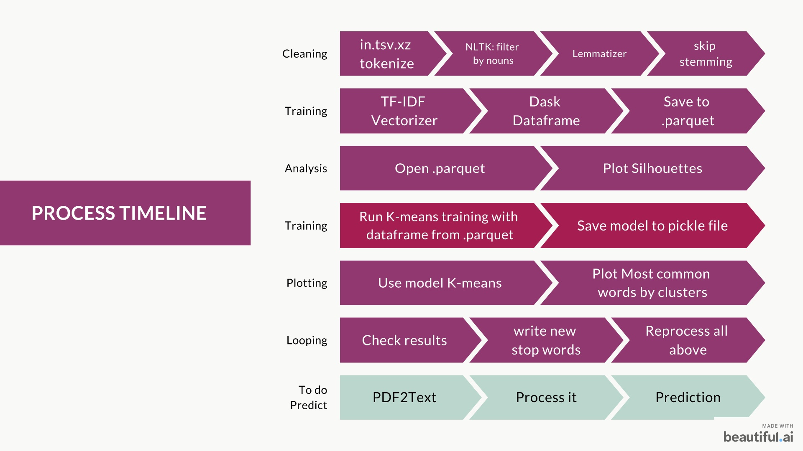

# Challenge: Documents Clustering using the TF-IDF
[](https://www.python.org/downloads/release/python-380/)

## The Mission
You are a new developer in the company and your mission is to use clustering techniques to classify the documents and reduce the manual work. Once your project is completed, the company will have the following improved workflow: 

## Mission objectives
- Implementation of natural language processing techniques.
- Implementation of unsupervised learning.
- Understand the advantages and limitations of different clustering algorithms.

## Setup
```bash
pip install -r requirements.txt
```

## Usage
### ```create_training_dataset.py```  
create the training dataset from ```data/in.tsv.xz``` file.
Clean, Tokenize, TF-IDF, and save the training dataset to ```data/training_dataset_{k}.parquet``` file. (where ```k``` is the number of entries in the training dataset)

### ```plot_silhouette.py```
create the silhouette plots in png for the analysis to find the best k (in k-means)
in ```data/analysis``` folder.

### ```word_clouds.py```
create the silhouette plots in png for the analysis
in ```data/analysis``` folder.

### ```__main__.py```
when run, the program train the model K-means and save the model to ```data/kmeans_{k}.pickle``` file.
then plot list of most common words by cluster k

## Briefing
check ```briefing.md``` for more details.

## Data
The dataset use here is from
[Kleister Charity Data](https://github.com/applicaai/kleister-charity)

# My Process
<p align="center">
  
</p>

# Difficulties
- Using Dask for parallel processing
- Package dependencies when swithching between computers
- Trying to use package that looks good but don't works properly.
- Transfer of knowledge from documentations examples to actual code.

# Additional Resources
[Presentation Slides here](assets/documents_clustering_slides.pdf) </br>
it show the plot for the silhouette analysis and result for the analysis of the most common words by cluster.